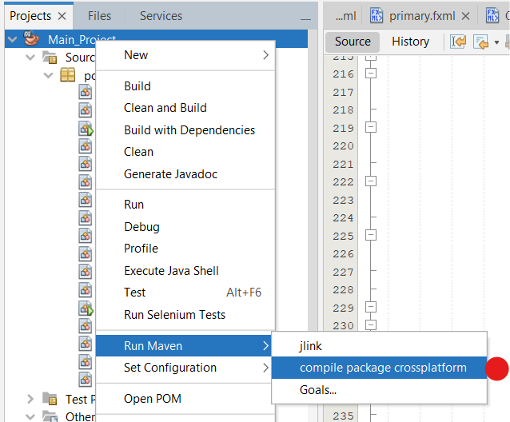

# Inventory Management System

A cross-platform JavaFX application for managing inventory, sales, purchases, and client/supplier relationships.

## Table of Contents

- [Inventory Management System](#inventory-management-system)
  - [Table of Contents](#table-of-contents)
  - [Authentication](#authentication)
  - [Project Structure](#project-structure)
  - [Usage Notes](#usage-notes)
  - [Cross-Platform JavaFX App](#cross-platform-javafx-app)
  - [Features](#features)
  - [System Requirements](#system-requirements)
  - [Installation \& Usage](#installation--usage)
    - [Building the Application](#building-the-application)
    - [Running the Application](#running-the-application)
  - [File Structure](#file-structure)
  - [Application Structure](#application-structure)
  - [Technical Details](#technical-details)
  - [Support](#support)
  - [Authors](#authors)

## Authentication

- **Username:** `bachir`
- **Password:** `bachir2023`

## Project Structure

Main_Project/</br>
├── src/</br>
│   └── main/</br>
│       └── java/</br>
│           └── poo/</br>
│               └── main_project/</br>
│                   ├── App.java                 # Main application entry point</br>
│                   ├── Launcher.java            # Application launcher</br>
│                   ├── PrimaryController.java   # Authentication controller</br>
│                   ├── SecondaryController.java # Main dashboard controller</br>
│                   ├── AcceuilController.java   # Home screen controller</br>
│                   ├── AchatController.java     # Purchase management controller</br>
│                   ├── VenteController.java     # Sales management controller</br>
│                   ├── InventaireController.java # Inventory controller</br>
│                   ├── JournalController.java   # Journal/transactions controller</br>
│                   ├── ClientController.java    # Client management controller</br>
│                   ├── FournisseurController.java # Supplier management controller</br>
│                   ├── Produit.java            # Product entity class</br>
│                   ├── Categorie.java          # Category entity class</br>
│                   ├── Client.java             # Client entity class</br>
│                   ├── Fournisseur.java        # Supplier entity class</br>
│                   ├── Individu.java           # Base individual class</br>
│                   ├── Facture.java            # Invoice/bill entity class</br>
│                   └── README.md               # Project documentation</br>
├── target/</br>
├── shade/                                       # Generated JAR directory</br>
├── Inventaire_Template.xlsx                    # Inventory database</br>
├── Journal.xlsx                                # Transaction journal</br>
├── Clients.xlsx                                # Client database</br>
├── Fournisseurs.xlsx                           # Supplier database</br>
└── pom.xml                                     # Maven configuration</br>

## Usage Notes

> **Note 1:** Press Enter once after each input or reference selection during purchase or sale operations.

## Cross-Platform JavaFX App

This project uses [maven-shade-plugin](https://maven.apache.org/plugins/maven-shade-plugin/) to compile a [Cross-Platform FAT-JAR](https://openjfx.io/openjfx-docs/#modular) executable on Windows 10, Linux, and macOS.

## Features

- **Inventory Management:** Track product stock levels with automatic status detection (Good, Critical, Out-of-stock)
- **Purchase Management:** Handle product procurement and supplier management
- **Sales Management:** Process customer orders and manage client relationships
- **Reporting:** View transaction history through the journal system
- **Data Persistence:** Excel-based storage for inventory, clients, suppliers, and transactions

## System Requirements

- Java 11 or higher
- 4GB RAM minimum
- 500MB disk space

## Installation & Usage

### Building the Application

You can generate the executable JAR file from any operating system:
```
$ mvn clean compile package
```

> This command is also defined in `nbactions.xml` and can be executed directly from NetBeans:
> 

### Running the Application

- The JAR will be generated in the `shade` directory
- Execute it on any operating system:
```
$ java -jar shade/Main_Project.jar
```

> On Windows, the file is executable by simply double-clicking it!

## File Structure

- **Inventory Data:** `Inventaire_Template.xlsx`
- **Transaction Journal:** `Journal.xlsx`
- **Client Database:** `Clients.xlsx`
- **Supplier Database:** `Fournisseurs.xlsx`

## Application Structure

The application consists of several modules:
1. **Authentication** - Secure login system
2. **Dashboard** - Main navigation interface
3. **Inventory** - Product management and stock monitoring
4. **Purchasing** - Supplier management and stock replenishment
5. **Sales** - Client management and order processing
6. **Journal** - Transaction history and audit trail

## Technical Details

- **Framework:** JavaFX with MaterialFX UI components
- **Spreadsheet Handling:** GemBox Spreadsheet library
- **Architecture:** MVC pattern with FXML controllers
- **Data Storage:** Excel files for persistence
## Support

For technical support or questions about the application, please ensure you have:
1. Java Runtime Environment installed
2. Required Excel files in the application directory
3. Valid login credentials

## Authors

- Amroun Lyes 
- Baghdadi Nadjib Aimen
- Medjadji Abdelghani
- Larbaoui Mohamed Rayan
- Amioud Younes